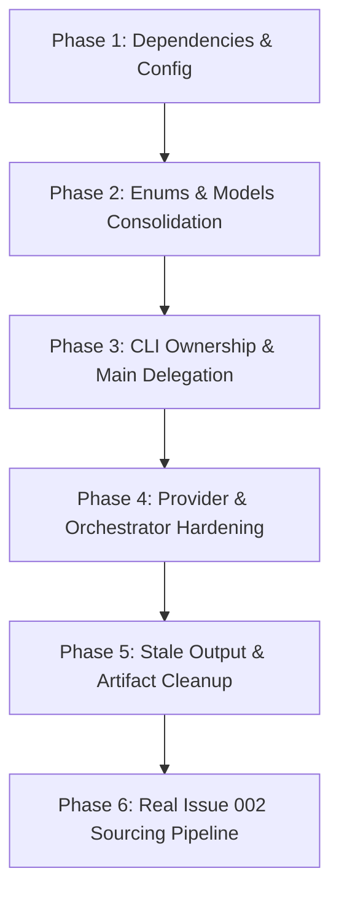

# Gemini Audit — K-Signal Repo Consistency

> **Audit Date:** August 10, 2026  
> **Primary Spec:** `K_SIGNAL_HARDENED_PROMPT.pdf`  
> **Target Path:** [`docs/audits/gemini_audit.md`](file:///C:/dev/k_signal_agent_ksignal_clickflow/docs/audits/gemini_audit.md)  
> **Status:** AUDIT COMPLETE — DO NOT PATCH CODE YET

---

## Executive Diagnosis

The K-Signal repository suffers from a severe **architectural split** between a legacy "newsletter/WordPress-style publishing clickflow" and the newly defined "hardened operational intelligence pipeline" (`seed -> discover -> capture -> correlate -> score -> brief -> render`).

While the hardened schema (`ksignal/engine/`) has been created, it is currently **an inert façade**:
1. **Primary Entry Point Disconnect:** [`main.py`](file:///C:/dev/k_signal_agent_ksignal_clickflow/main.py) only implements legacy subcommands (`build-from-inspect`, `export-social`, `publish-audit`). It contains **zero** of the 13 required hardened CLI commands (`source-seed`, `source-discover`, etc.).
2. **Fake Engine Execution:** The separate entry point [`ksignal_engine.py`](file:///C:/dev/k_signal_agent_ksignal_clickflow/ksignal_engine.py) delegates to [`ksignal/engine/cli.py`](file:///C:/dev/k_signal_agent_ksignal_clickflow/ksignal/engine/cli.py), where 7 core commands (`source-discover`, `source-capture`, `source-briefs`, `source-engine-run`, `instagram-capture`, `creative-engine-run`, `audit`) return hardcoded dummy JSON (`{"status": "pending"}`) without executing any real pipeline logic.
3. **Broken Test Suite Out-of-the-Box:** Running `pytest` directly fails immediately with `ModuleNotFoundError: No module named 'ksignal'` because [`pyproject.toml`](file:///C:/dev/k_signal_agent_ksignal_clickflow/pyproject.toml) lacks `pythonpath = ["."]`. When run via `python -m pytest`, total code coverage on `ksignal` is **29%**, failing the spec requirement of `>= 80%`.
4. **Missing Dependencies & Configs:** `apify-client` is imported in [`apify_instagram_provider.py`](file:///C:/dev/k_signal_agent_ksignal_clickflow/ksignal/engine/providers/apify_instagram_provider.py), but missing from [`requirements.txt`](file:///C:/dev/k_signal_agent_ksignal_clickflow/requirements.txt). Neither [`.env`](file:///C:/dev/k_signal_agent_ksignal_clickflow/.env) nor [`.env.example`](file:///C:/dev/k_signal_agent_ksignal_clickflow/.env.example) declares `APIFY_TOKEN`.
5. **Code & Artifact Sprawl:** 8 backup `.pre_*` source files and `.pyc` binaries sit inside live Python packages (`ksignal/` and `core/`). The root [`.gitignore`](file:///C:/dev/k_signal_agent_ksignal_clickflow/.gitignore) is only 6 lines long, omitting `.pytest_cache`, `.coverage`, `test-results/`, and `node_modules/`.

---

## Top 10 Risks

| Risk # | Risk Name | Description | Severity | Impact |
|---|---|---|---|---|
| **R-01** | **CLI Command Disconnect** | [`main.py`](file:///C:/dev/k_signal_agent_ksignal_clickflow/main.py) lacks all spec commands. Spec calls like `python main.py source-seed` crash. | **CRITICAL** | Complete failure to run hardened pipeline via main entry point. |
| **R-02** | **Stubbed Engine Pipeline** | [`ksignal/engine/cli.py`](file:///C:/dev/k_signal_agent_ksignal_clickflow/ksignal/engine/cli.py#L22) stubs 7 core commands with `{"status": "pending"}`. | **HIGH** | `source-discover`, `source-capture`, `source-briefs`, etc. do not execute. |
| **R-03** | **Undeclared Dependency Crash** | `apify-client` and `jinja2` are imported in code but omitted from [`requirements.txt`](file:///C:/dev/k_signal_agent_ksignal_clickflow/requirements.txt). | **HIGH** | Environment provisioning fails in fresh container or dev environment. |
| **R-04** | **Apify Provider Non-Compliance** | [`apify_instagram_provider.py`](file:///C:/dev/k_signal_agent_ksignal_clickflow/ksignal/engine/providers/apify_instagram_provider.py) lacks 24h counters, `_track_result`, and returns `ProviderResult` instead of `List[SourceNode]`. | **HIGH** | Provider status tracking and dataset normalization break spec contract. |
| **R-05** | **Pytest Pathing Failure** | Direct `pytest` execution fails due to missing `pythonpath` in [`pyproject.toml`](file:///C:/dev/k_signal_agent_ksignal_clickflow/pyproject.toml). | **MEDIUM** | Standard test runners and CI pipelines fail out-of-the-box. |
| **R-06** | **Low Test Coverage (29%)** | `pytest --cov=ksignal` yields 29% coverage (1014 missing lines). | **MEDIUM** | Critical engine pathways (discovery, pipeline, collectors) have 0% test coverage. |
| **R-07** | **Dual Competing Schemas** | Legacy [`ksignal/schema.py`](file:///C:/dev/k_signal_agent_ksignal_clickflow/ksignal/schema.py) (`SignalCard`) competes with hardened [`ksignal/engine/models.py`](file:///C:/dev/k_signal_agent_ksignal_clickflow/ksignal/engine/models.py) (`SourceNode`). | **MEDIUM** | Developers are confused over which models represent signal data. |
| **R-08** | **Multiple Render Pathways** | 4 parallel render implementations exist across `ksignal/render/`, `core/instagram_pack.py`, `core/instagram_reels.py`, and `ksignal/issue_builder.py`. | **MEDIUM** | Code duplication and fragmented asset output structure. |
| **R-09** | **Silent Render Degradation** | [`html_to_png.py`](file:///C:/dev/k_signal_agent_ksignal_clickflow/ksignal/render/html_to_png.py#L9-L10) silently creates PIL fallback images on Playwright error without raising or logging DEGRADED state. | **MEDIUM** | Corrupted or placeholder PNG assets generated silently. |
| **R-10** | **Committed Stale Artifacts** | Stale `.pre_*` files, `_issue_builder_original.pyc`, host-specific screenshots (`LAPTOP-2HGTHF5T`), and DuckDB binaries committed in `outputs/`. | **LOW** | Codebase pollution, merge conflicts, and repository bloat. |

---

## Architecture Map

```
k_signal_agent_ksignal_clickflow/
├── main.py                          # Legacy CLI entry point (15 subcommands; 0 spec commands)
├── ksignal_engine.py                # Hardened Engine CLI wrapper (routes to ksignal.engine.cli)
├── pyproject.toml                   # Python build metadata (lacks pytest pythonpath config)
├── requirements.txt                 # Runtime dependencies (missing apify-client, jinja2)
├── requirements-dev.txt             # Dev dependencies (missing pytest-cov)
├── package.json                     # Node devDependencies (pagefind, playwright, axe-core)
├── .gitignore                       # 6-line gitignore (missing .pytest_cache, .coverage, node_modules)
│
├── ksignal/                         # Core Python package
│   ├── engine/                      # HARDENED ENGINE V1 PIPELINE
│   │   ├── models.py                # SourceNode, CaptureVersion, Claim, CandidateScore, ProviderHealth
│   │   ├── scoring.py               # CandidateScore with weighted total & auto_queue_eligible
│   │   ├── orchestrator.py          # SourceOrchestrator routing Apify -> Browser fallback
│   │   ├── provider_health.py       # ProviderHealthStore updating outputs/source_engine/provider_health.json
│   │   ├── providers/               # Provider implementations
│   │   │   ├── base.py              # ProviderResult, ProviderFailure
│   │   │   ├── apify_instagram_provider.py # Apify Instagram scraper integration
│   │   │   ├── playwright_provider.py       # Playwright browser collector fallback
│   │   │   └── instagram_browser_provider.py # Playwright subclass for Instagram
│   │   ├── brief.py                 # CandidateBrief markdown & JSON writer
│   │   ├── claims.py                # Claim confidence framing logic
│   │   ├── corpus.py                # Issue 001 corpus baseline generator
│   │   ├── seed.py                  # Issue 002 5-lane seed queue generator
│   │   ├── velocity.py              # Signal velocity computer
│   │   ├── temporal.py              # Temporal recapture & snapshot appender
│   │   ├── differential.py          # Differential capture comparator
│   │   ├── correlate.py             # Entity & hashtag cross-correlator
│   │   ├── cli.py                   # Engine CLI dispatcher (STUBBED out for 7 commands!)
│   │   └── audit.py                 # Engine audit summary
│   │
│   ├── render/                      # HARDENED CREATIVE RENDER PIPELINE
│   │   ├── export.py                # CreativeRenderer (template -> HTML -> PNG -> manifest -> EDL)
│   │   ├── html_to_png.py           # Playwright HTML renderer (silent PIL fallback on fail)
│   │   ├── templates.py             # Jinja2 template loader
│   │   ├── asset_manifest.py        # AssetManifest model & writer
│   │   ├── edl.py                   # Video EDL generator
│   │   ├── remotion_plan.py         # Remotion scene plan builder
│   │   └── models.py                # RenderAsset & AssetManifest models
│   │
│   ├── collectors/                  # LEGACY COLLECTORS (browser, html, naver_api)
│   ├── relevance.py                 # LEGACY RELEVANCE & ARTICLE SCORE (competes with engine/scoring.py)
│   ├── schema.py                    # LEGACY SCHEMAS (SignalCard, RawItem - competes with engine/models.py)
│   ├── pipeline.py                  # LEGACY PIPELINE (run_pipeline for newsletter generation)
│   ├── issue_builder.py             # LEGACY ISSUE BUILDER (+ stale issue_builder.pre_watchlist.py)
│   └── site_stabilization.py        # LEGACY STABILIZATION (+ 6 stale .pre_* files)
│
├── core/                            # LEGACY CORE UTILITIES (creative_scout, distribution_pack, host_packager, instagram_pack, instagram_reels, link_checker, media_collector)
├── docs/                            # Documentation (24 spec & design files)
├── tests/                           # Pytest test suite (12 test files, 24 passing tests, 29% coverage)
└── outputs/                         # Artifact output folder (mixed source benchmarks & generated files)
```

---

## Spec Compliance Matrix

| Spec Requirement | Current Implementation | Status | Files Involved | Severity | Recommended Fix |
|---|---|---|---|---|---|
| **6 Access Statuses Only** | `CAPTURED`, `DEGRADED`, `DENIED`, `LOST`, `ERROR`, `PENDING` defined in [`models.py`](file:///C:/dev/k_signal_agent_ksignal_clickflow/ksignal/engine/models.py#L20). Legacy code uses `published`/`draft`. | **PARTIAL** | [`ksignal/engine/models.py`](file:///C:/dev/k_signal_agent_ksignal_clickflow/ksignal/engine/models.py), [`ksignal/schema.py`](file:///C:/dev/k_signal_agent_ksignal_clickflow/ksignal/schema.py) | **MEDIUM** | Deprecate legacy schema status literals; standardize all status references to `AccessStatus`. |
| **A-D Confidence Grades** | `ConfidenceGrade` enum (`A`, `B`, `C`, `D`) in [`models.py`](file:///C:/dev/k_signal_agent_ksignal_clickflow/ksignal/engine/models.py#L40). `Claim.confidence` field is `float` instead of `ConfidenceGrade`. | **PARTIAL** | [`ksignal/engine/models.py`](file:///C:/dev/k_signal_agent_ksignal_clickflow/ksignal/engine/models.py#L92) | **HIGH** | Fix `Claim.confidence` to be `ConfidenceGrade` directly per spec Module 2. |
| **SourceRole Taxonomy** | 16 roles (`origin_signal`, `korean_native_signal`, `official_context`, etc.) defined in [`models.py`](file:///C:/dev/k_signal_agent_ksignal_clickflow/ksignal/engine/models.py#L29). | **PASS** | [`ksignal/engine/models.py`](file:///C:/dev/k_signal_agent_ksignal_clickflow/ksignal/engine/models.py) | **LOW** | Retain as primary taxonomy. |
| **CaptureVersion Versioning** | `CaptureVersion` in [`models.py`](file:///C:/dev/k_signal_agent_ksignal_clickflow/ksignal/engine/models.py#L68). `extracted_text` is `Optional[str]` (spec requires `str`). | **PARTIAL** | [`ksignal/engine/models.py`](file:///C:/dev/k_signal_agent_ksignal_clickflow/ksignal/engine/models.py) | **MEDIUM** | Ensure `extracted_text` is non-optional `str` defaulted to `""`. |
| **SourceNode Schema** | Implemented in [`models.py`](file:///C:/dev/k_signal_agent_ksignal_clickflow/ksignal/engine/models.py#L107). `SourceType` includes un-specced `COMMERCE` value. | **PARTIAL** | [`ksignal/engine/models.py`](file:///C:/dev/k_signal_agent_ksignal_clickflow/ksignal/engine/models.py) | **MEDIUM** | Remove `COMMERCE` from `SourceType` enum to match spec exactly. |
| **Claim Taxonomy** | Implemented in [`models.py`](file:///C:/dev/k_signal_agent_ksignal_clickflow/ksignal/engine/models.py#L88) and [`claims.py`](file:///C:/dev/k_signal_agent_ksignal_clickflow/ksignal/engine/claims.py). `is_publishable()` method missing on `Claim`. | **PARTIAL** | [`ksignal/engine/models.py`](file:///C:/dev/k_signal_agent_ksignal_clickflow/ksignal/engine/models.py), [`ksignal/engine/claims.py`](file:///C:/dev/k_signal_agent_ksignal_clickflow/ksignal/engine/claims.py) | **MEDIUM** | Add `is_publishable(self) -> bool` method to `Claim` class per spec Module 2. |
| **Weighted CandidateScore** | 13 weighted criteria implemented in [`scoring.py`](file:///C:/dev/k_signal_agent_ksignal_clickflow/ksignal/engine/scoring.py). `total_weighted` matches spec formula. | **PASS** | [`ksignal/engine/scoring.py`](file:///C:/dev/k_signal_agent_ksignal_clickflow/ksignal/engine/scoring.py) | **LOW** | Retain implementation. |
| **Auto-Queue Threshold** | Threshold checks: `total_weighted >= 7.5`, `cross_correlation >= 6.0`, `signal_noise_ratio >= 6.0`, `korean_source_quality >= 7.0`. | **PASS** | [`ksignal/engine/scoring.py`](file:///C:/dev/k_signal_agent_ksignal_clickflow/ksignal/engine/scoring.py#L21) | **LOW** | Retain implementation. |
| **Apify-First Instagram** | Implemented in [`apify_instagram_provider.py`](file:///C:/dev/k_signal_agent_ksignal_clickflow/ksignal/engine/providers/apify_instagram_provider.py). Missing `_track_result`, 24h counters, auto-degrade. Returns `ProviderResult` instead of `List[SourceNode]`. | **PARTIAL** | [`ksignal/engine/providers/apify_instagram_provider.py`](file:///C:/dev/k_signal_agent_ksignal_clickflow/ksignal/engine/providers/apify_instagram_provider.py) | **HIGH** | Implement `_track_result`, failure count auto-degradation, and direct `SourceNode` normalization. |
| **Provider Fail-Fast** | Raises `ProviderFailure` (not spec `ProviderUnavailable`). Provider contains no fallback logic. | **PARTIAL** | [`ksignal/engine/providers/base.py`](file:///C:/dev/k_signal_agent_ksignal_clickflow/ksignal/engine/providers/base.py) | **MEDIUM** | Alias or subclass `ProviderFailure` to `ProviderUnavailable` per spec. |
| **Orchestrator Fallback** | [`orchestrator.py`](file:///C:/dev/k_signal_agent_ksignal_clickflow/ksignal/engine/orchestrator.py) catches provider failure and routes to Playwright browser fallback. | **PASS** | [`ksignal/engine/orchestrator.py`](file:///C:/dev/k_signal_agent_ksignal_clickflow/ksignal/engine/orchestrator.py) | **LOW** | Retain orchestrator ownership of fallback routing. |
| **Provider Health JSON** | Machine-readable JSON output to `outputs/source_engine/provider_health.json` via [`provider_health.py`](file:///C:/dev/k_signal_agent_ksignal_clickflow/ksignal/engine/provider_health.py). | **PARTIAL** | [`ksignal/engine/provider_health.py`](file:///C:/dev/k_signal_agent_ksignal_clickflow/ksignal/engine/provider_health.py) | **MEDIUM** | Calculate real 24h failure rate and response time rolling window. |
| **Temporal Tracking** | Append-only capture snapshot history implemented in [`temporal.py`](file:///C:/dev/k_signal_agent_ksignal_clickflow/ksignal/engine/temporal.py). | **PASS** | [`ksignal/engine/temporal.py`](file:///C:/dev/k_signal_agent_ksignal_clickflow/ksignal/engine/temporal.py) | **LOW** | Retain implementation. |
| **Differential Capture** | Field diffing across snapshots implemented in [`differential.py`](file:///C:/dev/k_signal_agent_ksignal_clickflow/ksignal/engine/differential.py). | **PASS** | [`ksignal/engine/differential.py`](file:///C:/dev/k_signal_agent_ksignal_clickflow/ksignal/engine/differential.py) | **LOW** | Retain implementation. |
| **Signal Velocity** | Velocity calculation and model implemented in [`velocity.py`](file:///C:/dev/k_signal_agent_ksignal_clickflow/ksignal/engine/velocity.py). | **PASS** | [`ksignal/engine/velocity.py`](file:///C:/dev/k_signal_agent_ksignal_clickflow/ksignal/engine/velocity.py) | **LOW** | Retain implementation. |
| **Issue 001 Corpus Test** | Immutable 4-card corpus benchmark generated without modifying public HTML via [`corpus.py`](file:///C:/dev/k_signal_agent_ksignal_clickflow/ksignal/engine/corpus.py). | **PASS** | [`ksignal/engine/corpus.py`](file:///C:/dev/k_signal_agent_ksignal_clickflow/ksignal/engine/corpus.py) | **LOW** | Retain implementation. |
| **Issue 002 5-Lane Plan** | 5 lanes (beauty, food, society, fandom, sports) generated via [`seed.py`](file:///C:/dev/k_signal_agent_ksignal_clickflow/ksignal/engine/seed.py). | **PASS** | [`ksignal/engine/seed.py`](file:///C:/dev/k_signal_agent_ksignal_clickflow/ksignal/engine/seed.py) | **LOW** | Retain implementation. |
| **Creative Render Pipeline** | Template -> HTML -> PNG -> Manifest -> EDL pipeline implemented in [`ksignal/render/export.py`](file:///C:/dev/k_signal_agent_ksignal_clickflow/ksignal/render/export.py). | **PASS** | [`ksignal/render/export.py`](file:///C:/dev/k_signal_agent_ksignal_clickflow/ksignal/render/export.py) | **LOW** | Retain implementation structure. |
| **PNG Render from HTML** | HTML template to PNG rendering implemented in [`html_to_png.py`](file:///C:/dev/k_signal_agent_ksignal_clickflow/ksignal/render/html_to_png.py). Silently creates PIL fallback on error. | **PARTIAL** | [`ksignal/render/html_to_png.py`](file:///C:/dev/k_signal_agent_ksignal_clickflow/ksignal/render/html_to_png.py#L9) | **MEDIUM** | Raise `RenderError` or set asset status to `DEGRADED` instead of silent PIL fallback. |
| **CLI Command Coverage** | 13 spec commands. [`main.py`](file:///C:/dev/k_signal_agent_ksignal_clickflow/main.py) has 0. [`ksignal_engine.py`](file:///C:/dev/k_signal_agent_ksignal_clickflow/ksignal_engine.py) has 13, but [`cli.py`](file:///C:/dev/k_signal_agent_ksignal_clickflow/ksignal/engine/cli.py#L22) stubs 7 commands with fake `pending` status. | **FAIL** | [`main.py`](file:///C:/dev/k_signal_agent_ksignal_clickflow/main.py), [`ksignal/engine/cli.py`](file:///C:/dev/k_signal_agent_ksignal_clickflow/ksignal/engine/cli.py) | **HIGH** | Wire all 13 commands into [`main.py`](file:///C:/dev/k_signal_agent_ksignal_clickflow/main.py) and implement real handlers in `cli.py`. |
| **Pytest Coverage >= 80%** | Total coverage on `ksignal` is currently **29%** (1014/1435 lines missed). Direct `pytest` command fails. | **FAIL** | [`pyproject.toml`](file:///C:/dev/k_signal_agent_ksignal_clickflow/pyproject.toml), [`tests/`](file:///C:/dev/k_signal_agent_ksignal_clickflow/tests/) | **HIGH** | Add `pythonpath = ["."]` to `pyproject.toml` and write missing unit/integration tests to reach >= 80%. |

---

## Duplicate Logic Findings

The codebase currently contains competing systems that must be consolidated:

1. **Access Statuses & Enums:**
   - **Spec System:** [`AccessStatus`](file:///C:/dev/k_signal_agent_ksignal_clickflow/ksignal/engine/models.py#L20) (`captured`, `degraded`, `denied`, `lost`, `error`, `pending`).
   - **Competing System:** Status strings (`published`, `draft`, `held`, `withdrawn`, `unpublished`) in [`ksignal/relevance.py`](file:///C:/dev/k_signal_agent_ksignal_clickflow/ksignal/relevance.py#L17) and [`core/link_checker.py`](file:///C:/dev/k_signal_agent_ksignal_clickflow/core/link_checker.py).

2. **Claim & Source Confidence Grading:**
   - **Spec System:** [`ConfidenceGrade`](file:///C:/dev/k_signal_agent_ksignal_clickflow/ksignal/engine/models.py#L40) (`A`, `B`, `C`, `D`).
   - **Competing System:** `Literal["low", "medium", "high"]` in legacy [`ksignal/schema.py`](file:///C:/dev/k_signal_agent_ksignal_clickflow/ksignal/schema.py#L37).

3. **Candidate Scoring Logic:**
   - **Spec System:** Weighted `CandidateScore` in [`ksignal/engine/scoring.py`](file:///C:/dev/k_signal_agent_ksignal_clickflow/ksignal/engine/scoring.py) (0-10 scale across 13 weighted fields).
   - **Competing System:** `score_candidate()` in [`ksignal/relevance.py`](file:///C:/dev/k_signal_agent_ksignal_clickflow/ksignal/relevance.py#L62) (additive integer scoring: same lane +25, shared entity +18, etc.).

4. **Creative Render Pipelines:**
   - **Spec System:** [`CreativeRenderer`](file:///C:/dev/k_signal_agent_ksignal_clickflow/ksignal/render/export.py) in `ksignal/render/` (template -> HTML -> PNG -> manifest -> EDL).
   - **Competing System 1:** [`export_social()`](file:///C:/dev/k_signal_agent_ksignal_clickflow/ksignal/issue_builder.py) in `ksignal/issue_builder.py` (renders 1080x1350 social HTML).
   - **Competing System 2:** [`create_instagram_pack()`](file:///C:/dev/k_signal_agent_ksignal_clickflow/core/instagram_pack.py) in `core/instagram_pack.py`.
   - **Competing System 3:** [`render_reels()`](file:///C:/dev/k_signal_agent_ksignal_clickflow/core/instagram_reels.py) in `core/instagram_reels.py`.

5. **Sourcing & Discovery Logic:**
   - **Spec System:** [`SourceOrchestrator`](file:///C:/dev/k_signal_agent_ksignal_clickflow/ksignal/engine/orchestrator.py) in `ksignal/engine/` using `ApifyInstagramProvider` and `PlaywrightProvider`.
   - **Competing System:** `run_pipeline()` in [`ksignal/pipeline.py`](file:///C:/dev/k_signal_agent_ksignal_clickflow/ksignal/pipeline.py), `web_searcher.py` in `core/`, and `naver_api.py` in `ksignal/collectors/`.

6. **CJK & Alias Normalization:**
   - **Location 1:** `DEFAULT_ALIASES` in [`ksignal/relevance.py`](file:///C:/dev/k_signal_agent_ksignal_clickflow/ksignal/relevance.py#L9).
   - **Location 2:** [`tools/cjk_pagefind_audit.mjs`](file:///C:/dev/k_signal_agent_ksignal_clickflow/tools/cjk_pagefind_audit.mjs).
   - **Location 3:** [`docs/CJK_SEARCH_ALIAS_STRATEGY.md`](file:///C:/dev/k_signal_agent_ksignal_clickflow/docs/CJK_SEARCH_ALIAS_STRATEGY.md).

7. **Mobile QA & Browser Audit Scripts:**
   - **Location 1:** [`tools/browser_qa_ksignal.py`](file:///C:/dev/k_signal_agent_ksignal_clickflow/tools/browser_qa_ksignal.py)
   - **Location 2:** [`tools/browser_qa_article_endings.py`](file:///C:/dev/k_signal_agent_ksignal_clickflow/tools/browser_qa_article_endings.py)
   - **Location 3:** [`tools/browser_qa_article_endings_final.py`](file:///C:/dev/k_signal_agent_ksignal_clickflow/tools/browser_qa_article_endings_final.py)
   - **Location 4:** [`tools/browser_qa_article_endings_rerun.py`](file:///C:/dev/k_signal_agent_ksignal_clickflow/tools/browser_qa_article_endings_rerun.py)
   - **Location 5:** [`scripts/predeploy_browser_audit.mjs`](file:///C:/dev/k_signal_agent_ksignal_clickflow/scripts/predeploy_browser_audit.mjs)
   - **Location 6:** [`scripts/predeploy_browser_audit_v2.mjs`](file:///C:/dev/k_signal_agent_ksignal_clickflow/scripts/predeploy_browser_audit_v2.mjs)
   - **Location 7:** [`scripts/run_predeploy_browser_audit.mjs`](file:///C:/dev/k_signal_agent_ksignal_clickflow/scripts/run_predeploy_browser_audit.mjs)

---

## Hardcoded / Config Findings

1. **Hardcoded Input Safety Banned Terms:**
   - [`tests/test_input_safety.py:8`](file:///C:/dev/k_signal_agent_ksignal_clickflow/tests/test_input_safety.py#L8) hardcodes local Windows paths: `("C:\\", "Users\\jgwrg", "OneDrive")`.
2. **Host Laptop Identifier in Generated Outputs:**
   - `outputs/issues/001/mobile_render_audit/` contains hardcoded host laptop identifiers in image filenames:
     - `android_small_card_02-LAPTOP-2HGTHF5T.png`
     - `iphone_13_card_02-LAPTOP-2HGTHF5T.png`
3. **Hardcoded Corpus Card IDs:**
   - [`ksignal/engine/corpus.py:7`](file:///C:/dev/k_signal_agent_ksignal_clickflow/ksignal/engine/corpus.py#L7) hardcodes `CARDS = {"card_01": ..., "card_02": ..., "card_03": ..., "card_04": ...}` instead of loading from a corpus config or fixture directory.
4. **Missing Environment Variable Declarations:**
   - `APIFY_TOKEN` is referenced in [`apify_instagram_provider.py`](file:///C:/dev/k_signal_agent_ksignal_clickflow/ksignal/engine/providers/apify_instagram_provider.py#L14), but is omitted from [`.env.example`](file:///C:/dev/k_signal_agent_ksignal_clickflow/.env.example).
5. **Hardcoded Output Paths:**
   - [`ksignal/engine/providers/playwright_provider.py:8`](file:///C:/dev/k_signal_agent_ksignal_clickflow/ksignal/engine/providers/playwright_provider.py#L8) hardcodes output directory `"outputs/source_engine/screenshots"` rather than taking `output_root` configuration.

---

## Generated Output / Stale Artifact Findings

1. **Stale Pre-Fix Code Files in Source Directories:**
   - `ksignal/site_stabilization.pre_android_tap_fix.py` (1,031 bytes)
   - `ksignal/site_stabilization.pre_combined_fix.py` (1,292 bytes)
   - `ksignal/site_stabilization.pre_dom_click_fix.py` (1,790 bytes)
   - `ksignal/site_stabilization.pre_lane_pagefind_fix.py` (1,462 bytes)
   - `ksignal/site_stabilization.pre_metadata_presence_fix.py` (1,218 bytes)
   - `ksignal/site_stabilization.pre_pagefind_fix.py` (5,750 bytes)
   - `ksignal/issue_builder.pre_watchlist.py` (5,893 bytes)
   - `core/host_packager.pre_watchlist.py` (6,114 bytes)
   - `ksignal/_issue_builder_original.pyc` (85,496 bytes compiled bytecode)
2. **Committed Database & Output Artifacts:**
   - `outputs/source_engine/ksignal_intelligence.duckdb` (DuckDB database file committed under `outputs/`).
   - `outputs/research/mobile_reference_audit/*.blocked.txt` (Error output text files from failed browser renders committed to output history).
3. **Static Self-Auditing Scripts:**
   - [`scripts/write_predeploy_reports.py`](file:///C:/dev/k_signal_agent_ksignal_clickflow/scripts/write_predeploy_reports.py#L13) writes markdown reports stating `"Status: PASS"` without running live unit tests or validating output binaries against schema specs.

---

## Test Integrity Findings

1. **Test Runner Instability:**
   - Running `pytest` directly in the shell fails immediately with `ModuleNotFoundError: No module named 'ksignal'`.
   - **Root Cause:** [`pyproject.toml`](file:///C:/dev/k_signal_agent_ksignal_clickflow/pyproject.toml) lacks `[tool.pytest.ini_options]` setting `pythonpath = ["."]`.
2. **Low Test Coverage (29% Total):**
   - Running `python -m pytest --cov=ksignal` passes 24 unit tests, but coverage across the `ksignal` package is only **29%**.
   - Zero coverage (0%) on key engine modules: [`ksignal/engine/seed.py`](file:///C:/dev/k_signal_agent_ksignal_clickflow/ksignal/engine/seed.py), [`ksignal/engine/corpus.py`](file:///C:/dev/k_signal_agent_ksignal_clickflow/ksignal/engine/corpus.py), [`ksignal/engine/cli.py`](file:///C:/dev/k_signal_agent_ksignal_clickflow/ksignal/engine/cli.py), [`ksignal/engine/audit.py`](file:///C:/dev/k_signal_agent_ksignal_clickflow/ksignal/engine/audit.py), [`ksignal/pipeline.py`](file:///C:/dev/k_signal_agent_ksignal_clickflow/ksignal/pipeline.py), [`ksignal/discovery.py`](file:///C:/dev/k_signal_agent_ksignal_clickflow/ksignal/discovery.py).
3. **Shallow Test Assertions:**
   - [`tests/test_apify_normalization.py`](file:///C:/dev/k_signal_agent_ksignal_clickflow/tests/test_apify_normalization.py) only tests basic string field mapping from a dictionary; it does not test missing token handling, API rate limits, network timeouts, or invalid payload structures.
   - [`tests/test_orchestrator_fallback.py`](file:///C:/dev/k_signal_agent_ksignal_clickflow/tests/test_orchestrator_fallback.py) tests fallback by injecting mock providers; it does not test real browser fallback execution or error recovery.
   - [`tests/test_render_pipeline.py`](file:///C:/dev/k_signal_agent_ksignal_clickflow/tests/test_render_pipeline.py) checks whether generated PNG files exist on disk, but does not inspect PNG image dimensions, pixel content, or verify whether Playwright succeeded versus falling back to PIL.
4. **Missing Test Coverage:**
   - No unit or integration tests exist for CLI commands in [`main.py`](file:///C:/dev/k_signal_agent_ksignal_clickflow/main.py) or [`ksignal_engine.py`](file:///C:/dev/k_signal_agent_ksignal_clickflow/ksignal_engine.py).

---

## CLI Consistency Findings

The hardened prompt specifies 13 CLI commands to be executed via `python main.py <command>`:

| Command | Expected Spec Behavior | In [`main.py`](file:///C:/dev/k_signal_agent_ksignal_clickflow/main.py)? | In [`ksignal_engine.py`](file:///C:/dev/k_signal_agent_ksignal_clickflow/ksignal_engine.py)? | Implementation Status in `cli.py` |
|---|---|---|---|---|
| `source-seed` | Generate Issue 002 seed queue for 5 lanes | **NO** | YES | **PASS** (returns real JSON) |
| `source-discover` | Discover URLs across seeds & lanes | **NO** | YES | **STUBBED** (`{"status": "pending"}`) |
| `source-capture` | Capture versioned snapshots for candidate | **NO** | YES | **STUBBED** (`{"status": "pending"}`) |
| `source-briefs` | Render candidate briefs & filter auto-queue | **NO** | YES | **STUBBED** (`{"status": "pending"}`) |
| `source-engine-run` | End-to-end source engine execution | **NO** | YES | **STUBBED** (`{"status": "pending"}`) |
| `instagram-discover` | Discover Instagram posts via Apify | **NO** | YES | **PARTIAL** (executes Apify discovery) |
| `instagram-capture` | Capture Instagram URLs via fallback | **NO** | YES | **STUBBED** (`{"status": "pending"}`) |
| `creative-render` | Render HTML template PNGs & EDL | **NO** | YES | **PARTIAL** (executes CreativeRenderer) |
| `creative-engine-run` | End-to-end creative render for issue | **NO** | YES | **STUBBED** (`{"status": "pending"}`) |
| `source-engine-test` | Run Issue 001 corpus test benchmark | **NO** | YES | **PASS** (returns corpus test JSON) |
| `audit` | Generate issue intelligence audit report | **NO** | YES | **STUBBED** (`{"status": "pending"}`) |
| `provider-health` | Output machine-readable provider status | **NO** | YES | **PASS** (prints provider_health.json) |
| `signal-velocity` | Calculate signal velocity for issue window | **NO** | YES | **PASS** (returns SignalVelocity JSON) |

**Conclusion:** [`main.py`](file:///C:/dev/k_signal_agent_ksignal_clickflow/main.py) is completely un-wired for the hardened spec, while [`ksignal/engine/cli.py`](file:///C:/dev/k_signal_agent_ksignal_clickflow/ksignal/engine/cli.py#L22) stubs 7 of the 13 commands.

---

## Dependency / Config Findings

1. **Python Dependencies ([`requirements.txt`](file:///C:/dev/k_signal_agent_ksignal_clickflow/requirements.txt)):**
   - **Missing Runtime Imports:** `apify-client` (imported in `apify_instagram_provider.py`), `jinja2` (required for HTML template rendering in `ksignal/render/templates.py`), `pypdf` (required for PDF document parsing).
2. **Dev Dependencies ([`requirements-dev.txt`](file:///C:/dev/k_signal_agent_ksignal_clickflow/requirements-dev.txt)):**
   - **Missing Dev Package:** `pytest-cov` (used for test coverage measurement).
3. **Environment Configuration ([`.env.example`](file:///C:/dev/k_signal_agent_ksignal_clickflow/.env.example)):**
   - **Missing Key:** `APIFY_TOKEN` is missing from [`.env.example`](file:///C:/dev/k_signal_agent_ksignal_clickflow/.env.example).
4. **Git Ignore ([`.gitignore`](file:///C:/dev/k_signal_agent_ksignal_clickflow/.gitignore)):**
   - **Missing Ignore Patterns:** `.pytest_cache/`, `.coverage`, `test-results/`, `*.egg-info/`, `node_modules/`, `*.duckdb`.
5. **System Dependencies:**
   - Playwright browser binaries must be installed via `playwright install chromium`.
   - `ffmpeg` is optional for reel video assembly; when absent, the renderer creates reel frames and logs a warning.

---

## Maintainability Findings

If a new hired developer starts next month, they will encounter immediate friction:
1. **Entry Point Confusion:** They will not know whether to run [`main.py`](file:///C:/dev/k_signal_agent_ksignal_clickflow/main.py) (which contains legacy newsletter subcommands) or [`ksignal_engine.py`](file:///C:/dev/k_signal_agent_ksignal_clickflow/ksignal_engine.py) (which contains hardened engine subcommands).
2. **Dead Code & Backup File Pollution:** 8 `.pre_*` backup Python files exist alongside active code inside `ksignal/` and `core/`.
3. **Domain Boundary Confusion:** The line between the "Source Engine" (`ksignal/engine/`), the "Creative Renderer" (`ksignal/render/`), and legacy "Issue Packagers" (`core/`) is blurred due to duplicate scoring functions and multiple render paths.
4. **Documentation Disconnect:** The root [`README.md`](file:///C:/dev/k_signal_agent_ksignal_clickflow/README.md) is only 421 bytes and does not describe the hardened pipeline or CLI commands.

---

## Recommended Refactor Sequence

Do not perform a giant rewrite. Implement the following 6-phase refactor sequence:



### Phase 1: Stabilize Dependencies & Config
- **Files to touch:** [`requirements.txt`](file:///C:/dev/k_signal_agent_ksignal_clickflow/requirements.txt), [`requirements-dev.txt`](file:///C:/dev/k_signal_agent_ksignal_clickflow/requirements-dev.txt), [`.env.example`](file:///C:/dev/k_signal_agent_ksignal_clickflow/.env.example), [`.gitignore`](file:///C:/dev/k_signal_agent_ksignal_clickflow/.gitignore), [`pyproject.toml`](file:///C:/dev/k_signal_agent_ksignal_clickflow/pyproject.toml).
- **Actions:**
  1. Add `apify-client`, `jinja2`, `pypdf` to `requirements.txt`.
  2. Add `pytest-cov` to `requirements-dev.txt`.
  3. Add `APIFY_TOKEN=` to `.env.example`.
  4. Add `.pytest_cache/`, `.coverage`, `test-results/`, `node_modules/`, `*.duckdb` to `.gitignore`.
  5. Add `[tool.pytest.ini_options]` with `pythonpath = ["."]` to `pyproject.toml`.
- **Tests to run:** `pytest` (verify bare command works).
- **Expected Risk:** LOW.
- **Acceptance Criteria:** `pytest` executes without `ModuleNotFoundError`.

### Phase 2: Consolidate Enums & Models
- **Files to touch:** [`ksignal/engine/models.py`](file:///C:/dev/k_signal_agent_ksignal_clickflow/ksignal/engine/models.py), [`ksignal/schema.py`](file:///C:/dev/k_signal_agent_ksignal_clickflow/ksignal/schema.py).
- **Actions:**
  1. Fix `Claim.confidence` field in `models.py` to be `ConfidenceGrade` directly.
  2. Add `is_publishable(self) -> bool` method to `Claim` class.
  3. Remove `COMMERCE` from `SourceType` enum.
  4. Deprecate legacy confidence literals in `schema.py` in favor of `ConfidenceGrade`.
- **Tests to run:** `python -m pytest tests/test_source_models.py tests/test_claim_taxonomy.py`.
- **Expected Risk:** LOW.
- **Acceptance Criteria:** `Claim` model complies 100% with spec Module 2.

### Phase 3: Clean CLI Ownership & Main Delegation
- **Files to touch:** [`main.py`](file:///C:/dev/k_signal_agent_ksignal_clickflow/main.py), [`ksignal_engine.py`](file:///C:/dev/k_signal_agent_ksignal_clickflow/ksignal_engine.py), [`ksignal/engine/cli.py`](file:///C:/dev/k_signal_agent_ksignal_clickflow/ksignal/engine/cli.py).
- **Actions:**
  1. Register all 13 spec commands in [`main.py`](file:///C:/dev/k_signal_agent_ksignal_clickflow/main.py).
  2. Make [`ksignal_engine.py`](file:///C:/dev/k_signal_agent_ksignal_clickflow/ksignal_engine.py) a simple alias to `main.py`.
  3. Un-stub the 7 pending commands in `ksignal/engine/cli.py` so they route to actual engine implementations.
- **Tests to run:** Add `tests/test_cli.py` and run `pytest tests/test_cli.py`.
- **Expected Risk:** MEDIUM.
- **Acceptance Criteria:** `python main.py source-seed --issue 002 --lane fandom` executes cleanly.

### Phase 4: Harden Provider & Orchestrator Tests
- **Files to touch:** [`ksignal/engine/providers/apify_instagram_provider.py`](file:///C:/dev/k_signal_agent_ksignal_clickflow/ksignal/engine/providers/apify_instagram_provider.py), [`ksignal/engine/orchestrator.py`](file:///C:/dev/k_signal_agent_ksignal_clickflow/ksignal/engine/orchestrator.py), [`tests/test_apify_normalization.py`](file:///C:/dev/k_signal_agent_ksignal_clickflow/tests/test_apify_normalization.py), [`tests/test_orchestrator_fallback.py`](file:///C:/dev/k_signal_agent_ksignal_clickflow/tests/test_orchestrator_fallback.py).
- **Actions:**
  1. Add `_track_result` and 24h failure counters to `ApifyInstagramProvider`.
  2. Ensure `discover_hashtag` normalizes dataset to `List[SourceNode]`.
  3. Verify orchestrator logs run metadata and updates `provider_health.json` on failure.
- **Tests to run:** `pytest tests/test_apify_normalization.py tests/test_orchestrator_fallback.py tests/test_provider_health.py`.
- **Expected Risk:** MEDIUM.
- **Acceptance Criteria:** Provider health updates dynamically; failed Apify calls trigger Playwright fallback.

### Phase 5: Clean Generated Outputs & Stale Artifacts
- **Files to remove:** All 8 `.pre_*` files in `ksignal/` and `core/`, `_issue_builder_original.pyc`, committed DuckDB database in `outputs/`.
- **Actions:** Remove stale files from git tracking.
- **Tests to run:** `pytest` (ensure no imports break).
- **Expected Risk:** LOW.
- **Acceptance Criteria:** Clean working directory with no dead source files.

### Phase 6: Wire Real Issue 002 Sourcing & Creative Render
- **Files to touch:** [`ksignal/engine/cli.py`](file:///C:/dev/k_signal_agent_ksignal_clickflow/ksignal/engine/cli.py), [`ksignal/render/export.py`](file:///C:/dev/k_signal_agent_ksignal_clickflow/ksignal/render/export.py).
- **Actions:**
  1. Connect `source-discover`, `source-capture`, `source-briefs`, `creative-render` to end-to-end execution.
  2. Generate candidate briefs with Claims Register tables.
  3. Produce PNG assets and asset manifests under `outputs/issues/002/creative/`.
- **Tests to run:** `pytest --cov=ksignal`.
- **Expected Risk:** MEDIUM.
- **Acceptance Criteria:** Total code coverage reaches `>= 80%`.

---

## Tests To Add

1. **`tests/test_cli.py`**
   - Test all 13 spec CLI commands via `ArgumentParser` and `run_command()`.
   - Verify argument defaults (`--issue 002`, `--auto-queue-threshold 7.5`).
2. **`tests/test_apify_failure_modes.py`**
   - Test `ApifyInstagramProvider` initialized without token (`AUTH_MISSING`).
   - Test 429 rate-limiting response (transitions to `DEGRADED`).
   - Test > 5 consecutive failures (transitions to `DEGRADED`).
3. **`tests/test_orchestrator_live_fallback.py`**
   - Test orchestrator fallback when Apify raises `ProviderFailure`.
   - Verify `manual_queue.json` created when access is `DEGRADED` or `ERROR`.
   - Verify `provider_health.json` updated with timestamp and failure mode.
4. **`tests/test_render_asset_validation.py`**
   - Test `CreativeRenderer.render()` output directory structure.
   - Verify generated PNG dimensions (1080x1350 / 1200x630).
   - Test error handling when Playwright fails (ensure asset status is set to `ERROR` or `DEGRADED` rather than silent success).
5. **`tests/test_claim_framing.py`**
   - Test claim confidence framing prefixes across A, B, C, D grades.
   - Verify `is_publishable()` returns True for all properly framed claims.

---

## Do-Not-Touch List

1. **[`K_SIGNAL_HARDENED_PROMPT.pdf`](file:///C:/Users/jgwrg/Downloads/K_SIGNAL_HARDENED_PROMPT.pdf)** — Immutable architecture spec.
2. **[`ksignal/engine/scoring.py`](file:///C:/dev/k_signal_agent_ksignal_clickflow/ksignal/engine/scoring.py)** — Do NOT alter the weighting formula (`1.5`, `1.3`, `1.2`, etc.) or the `auto_queue_eligible` threshold logic (`total_weighted >= 7.5`).
3. **[`ksignal/engine/corpus.py`](file:///C:/dev/k_signal_agent_ksignal_clickflow/ksignal/engine/corpus.py)** — Do NOT modify Issue 001 corpus test output contracts.
4. **[`docs/`](file:///C:/dev/k_signal_agent_ksignal_clickflow/docs/)** — Preserve existing operational architecture documentation.

---

## Exact Verification Commands

Run the following commands to verify system status after reading this audit:

```bash
# 1. Verify Pytest Execution & Coverage
.venv\Scripts\python.exe -m pytest --cov=ksignal

# 2. Test Issue 001 Corpus Baseline Command
.venv\Scripts\python.exe ksignal_engine.py source-engine-test --issue 001

# 3. Test Issue 002 Seed Queue Command
.venv\Scripts\python.exe ksignal_engine.py source-seed --issue 002 --lane fandom

# 4. Check Provider Health Status Command
.venv\Scripts\python.exe ksignal_engine.py provider-health

# 5. Check Signal Velocity Command
.venv\Scripts\python.exe ksignal_engine.py signal-velocity --issue 002
```

---
*Audit completed by Antigravity AI Coding Assistant.*
